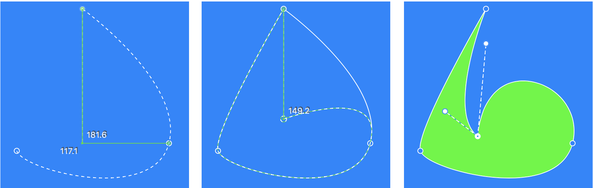
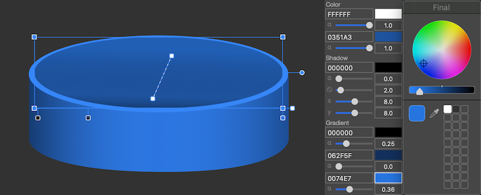
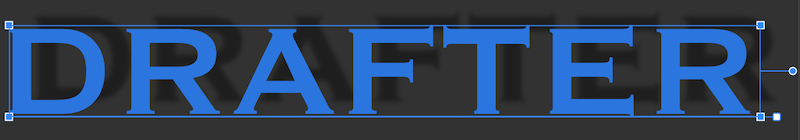
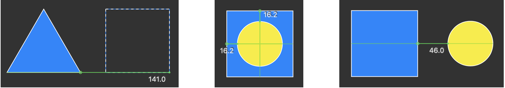

Vector Editor for MacOS. 

Easy tool for create sketches

WIP

v0.69

# Features

All tools in canvas. No hidden menus with many tabs.

Create and edit curve with mouse and 3 additional keys (^ (Control),  ⌥(Option) & Delete)

Permanent gradient. Every shape has gradient layer.  Setup alpha & color and you done

Permanent shadow layer. To remove just set alpha to zero

Built-in rulers

# Tools & Hotkeys

Select (D), Line (L), Triangle (T), Rectangle (R) Pentagon(P), Hex(H), Arc (A), Oval (O), Stylus (S)

Curve (C) - press ⚙ to edit shape with control dots

Font (F) - type text in text field, hit Enter and create vector representation

# Combos

Common

Close (⌘W), Quit (⌘Q) - not implemented safe exit

Files

New (⌘N) Open (⌘O) - open .png  Save (⌘S), Save-As (⇧⌘S) - save to .png

Edit

Cut (⌘X) - place selected shape to the buffer

Copy (⌘C) - copy selected shape, Paste (⌘V) - paste shape to the mouse position  

Delete (Delete) - remove shape or control dot

Undo (⌘Z) - not implemented 

Redo (⇧⌘Z) - not implemented 

Modifiers

Create shape with ⌘(Cmd) to make width and height equal

Resize shapes proportionaly with ⌘(Cmd) 

Drag shape with ^(Control) to switch off "snap to rullers"

Select shape with ⌥(Option) key to clone it

Drag control dot with ^(Control) to switch off "snap to rullers"

Drag mouse with  ⌥(Option) key to edit control dot

Canvas

Magnification gesture. Two fingers zoom

Pan gesture. Drag canvas with two fingers

# Future releases

v0.71 Edit Groups

v0.73 Undo Redo

v0.75 Improve Text

v0.8 Filters

v0.9 Layers

v1.0 .svg

Bugs:  FastRotate, SaveBlur

