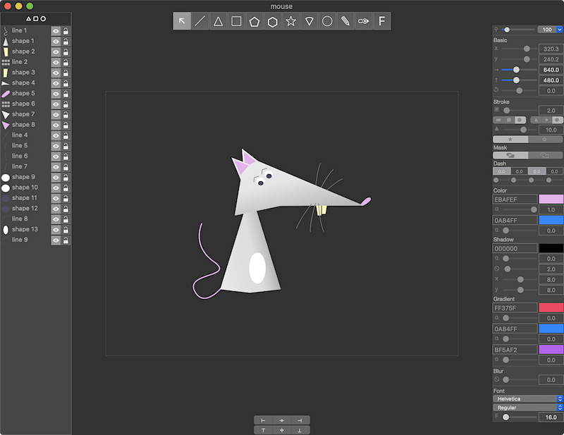

# Drafter

## v1.16

Vector editor.

Create, edit, and export images as a `.drf` file or `.png` file.

### Usage

All tools are available directly on the canvas. No hidden menus or multiple tabs.

Edit shapes with control dots. Shape preview is available while editing.

Each shape has a gradient layer. Set color and alpha to adjust it.

Each shape has a permanent shadow layer. Set alpha to `0` to remove it.

Built-in rulers are available for alignment.

#### Tools & Hotkeys

`Select` (`M`) - select shapes.

`Line` (`L`) - create lines.

`Triangle` (`T`) - create triangles.

`Rectangle` (`R`) - create rectangles.

`Pentagon` (`P`) - create pentagons.

`Hex` (`H`) - create hexagons.

`Star` (`S`) - create stars.

`Arc` (`A`) - create arcs.

`Oval` (`O`) - create ovals.

`Stylus` (`D`) - draw with a stylus.

`Vector` (`V`) - edit a shape with control dots. Press `⚙` or `Return` to enter vector edit mode.

`Font` (`F`) - enter text and create a vector representation.

#### Files

`New` (`⌘N`) - create a new document.

`Open` (`⌘O`) - open a `.drf` or `.png` file.

`Save` (`⌘S`) - save as `.drf` or `.png`.

`Save As` (`⇧⌘S`) - save as `.drf` or `.png`.

#### Edit

`Undo` (`⌘Z`) - undo up to 16 operations.

`Redo` (`⇧⌘Z`) - redo up to 16 operations.

`Cut` (`⌘X`) - remove the selected shape and copy it to the buffer.

`Copy` (`⌘C`) - copy the selected shape.

`Paste` (`⌘V`) - paste a shape at the mouse position.

`Group` (`⌘G`) - group selected shapes.

`Ungroup` (`⇧⌘G`) - remove a group.

`Delete` (`Delete`) - remove a shape or control dot.

`Select All` (`⌘A`) - select all shapes or control dots.

#### Modifiers

##### Shape Mode

`⇧` `Shift` + drag - create shapes with equal width and height.

`⇧` `Shift` + drag - create straight lines and vectors.

`⇧` `Shift` + resize - keep proportions.

`⌃` `Control` + `LMB` - select multiple shapes.

`⌃` `Control` + `LMB` - deselect a selected shape.

`fn` `Function` + drag - enable ruler snapping.

`⌘` `Cmd` + click - clone a shape.

##### Edit Mode

`⌃` `Control` - disable preview.

`⌃` `Control` + `LMB` - select multiple control dots.

`⌃` `Control` + `LMB` - deselect a selected control dot.

`⇧` `Shift` + drag - move a control dot in a straight line.

`fn` `Function` + drag - enable ruler snapping.

`⌥` `Option` + drag - move selected control dots toward or away from their center point.

`⌘` `Cmd` + drag - show control dots.

#### Canvas

Two-finger gesture - zoom the canvas.

Two-finger scroll - move the canvas.

### Performance

Comfortable editing is possible with fewer than `100` layers.

### Credits

Design/Art/Code: [Aliaksandr Veledzimovich](https://twitter.com/veledzimovich) 

