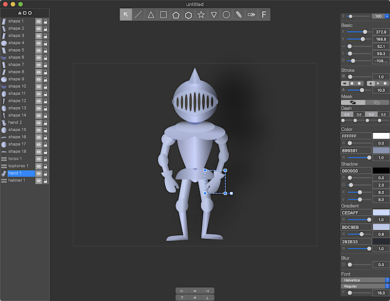
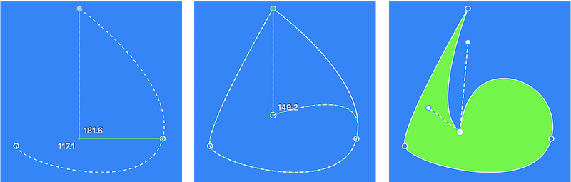

Vector Editor for MacOS.

Easy tool for create sketches

WIP

v0.99

# Features

All tools in canvas. No hidden menus with many tabs.

Use preview when edit shape. 
Use standart keys to transform shapes (⌘(Cmd), ⌥(Option), ⇧(Shift) & Delete)

Every shape has gradient layer.  Setup alpha & color and you are done

Permanent shadow layer. To remove just set alpha to zero

Built-in rulers

# Perfomance

Drafter v0.97 comfort work is possible when used less than 100 layers

# Tools & Hotkeys

Select (M), Line (L), Triangle (T), Rectangle (R) Pentagon(P), Hex(H), Star(S), Arc (A), Oval (O), Stylus (D)

Vector (V) - press ⚙ in pop-up menu to edit shape with control dots

Font (F) - type text in text field, hit Enter and create vector representation

# Combos

Close (⌘W), Quit (⌘Q) -  safe exit

- Files

New (⌘N) Open (⌘O) - open *.drf or *.png  

Save (⌘S), Save-As (⇧⌘S) - save to *.drf or *.png

- Edit

Undo (⌘Z), Redo (⇧⌘Z) - 4 operations

Cut (⌘X) - remove selected shape and copy to the buffer, Copy (⌘C) - copy selected shape

Paste (⌘V) - paste shape to the mouse position

Group (⌘G), Ungroup (⇧⌘G)  - create/remove group for selectted shapes

Delete (Delete) - remove shape or control dot

SelectAll(⌘A) - select all shapes or dots

- Modifiers

Shape mode

Use ⇧(Shift) and drag to make width and height equal when create shape

Use ⇧(Shift) and drag for straight lines when create Line and Vector

Resize shapes proportionaly with ⇧(Shift)

Use ^(Control) + LMB to select more than one shape

If shape selected press ^(Control) + LMB to deselect dot

Drag shape with fn(Function) to turn on "snap to rullers"

Click on shape with ⌘(Cmd)  to clone it

Edit mode

Use ^(Control) to disable preview

Use ^(Control) + LMB to select more than one dot

If dot selected press ^(Control) + LMB to deselect dot

Use ⇧(Shift) and drag for move dot straight

Drag dot with fn(Function) to turn on "snap to rullers"

When select more than one dot drag  with ⌥(Option) to "zoom move"

Drag mouse with ⌘(Cmd)  to show control dots

- Canvas

Magnification gesture. Two fingers zoom

Scroll canvas with two fingers

# Road map

v1.0 Group Members Bugs: UndoRedo

v1.5 .svg

