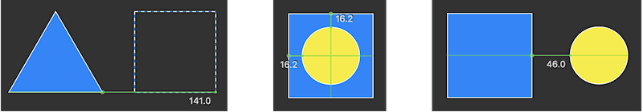

Vector Editor for MacOS.

Easy tool for create sketches

WIP

v0.76

# Features

All tools in canvas. No hidden menus with many tabs.

Use preview when edit curve. Use standart keys to transform curves (⌘(Cmd), ⌥(Option), ⇧(Shift) & Delete)

Permanent gradient. Every shape has gradient layer.  Setup alpha & color and you done

Permanent shadow layer. To remove just set alpha to zero

Built-in rulers

# Tools & Hotkeys

Select (D), Line (L), Triangle (T), Rectangle (R) Pentagon(P), Hex(H), Arc (A), Oval (O), Stylus (S)

Vector (V) - press ⚙ in pop-up menu to edit shape with control dots

Font (F) - type text in text field, hit Enter and create vector representation

# Combos

- Common

Close (⌘W), Quit (⌘Q) - not implemented safe exit

- Files

New (⌘N) Open (⌘O) - open .png  Save (⌘S), Save-As (⇧⌘S) - save to .png

- Edit

Undo (⌘Z), Redo (⇧⌘Z) - not implemented

Cut (⌘X) - place selected shape to the buffer, Copy (⌘C) - copy selected shape
Paste (⌘V) - paste shape to the mouse position

Group (⌘G), Ungroup (⇧⌘G) 

Delete (Delete) - remove shape or control dot

- Modifiers

Create shape with ⇧(Shift) to make width and height equal

Resize shapes proportionaly with ⇧(Shift)

Drag shape or dot with ^(Control) to switch off "snap to rullers"

Select shape with ⌥(Option) to clone it

Drag mouse with  ⌘(Cmd) key to edit control dot

Use ⌥(Option) for edit control dots separately

Use ⇧(Shift) for straight lines and diagonals with Line and Curve

- Canvas

Magnification gesture. Two fingers zoom

Scroll canvas with two fingers

# Future releases

v0.77 Improve Text

v0.8 Undo Redo

v0.9 .drf

v1.0 Filters

v1.5 .svg

Bugs:  SaveBlur Rotate image Rearrange Stack

